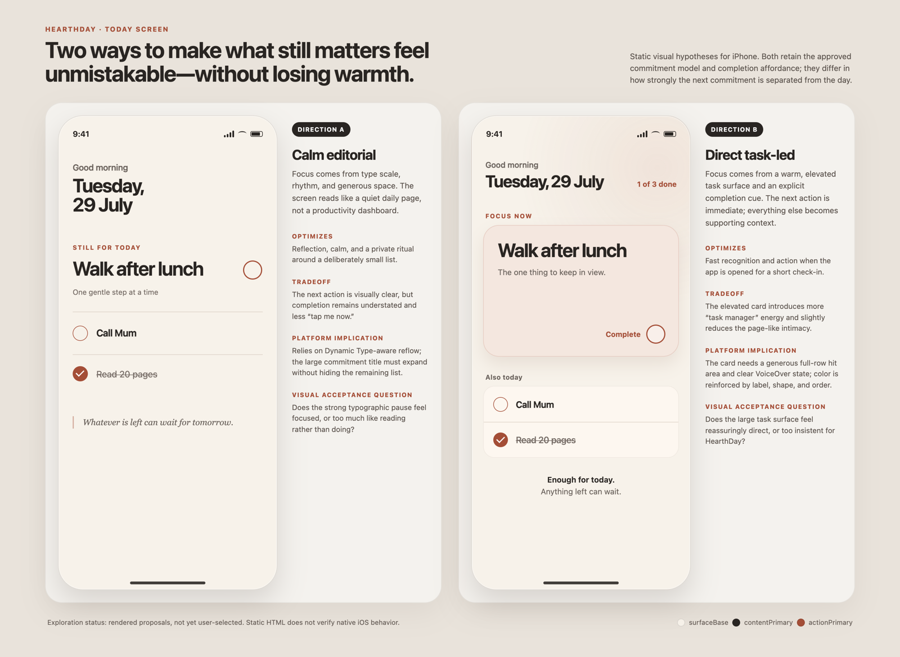
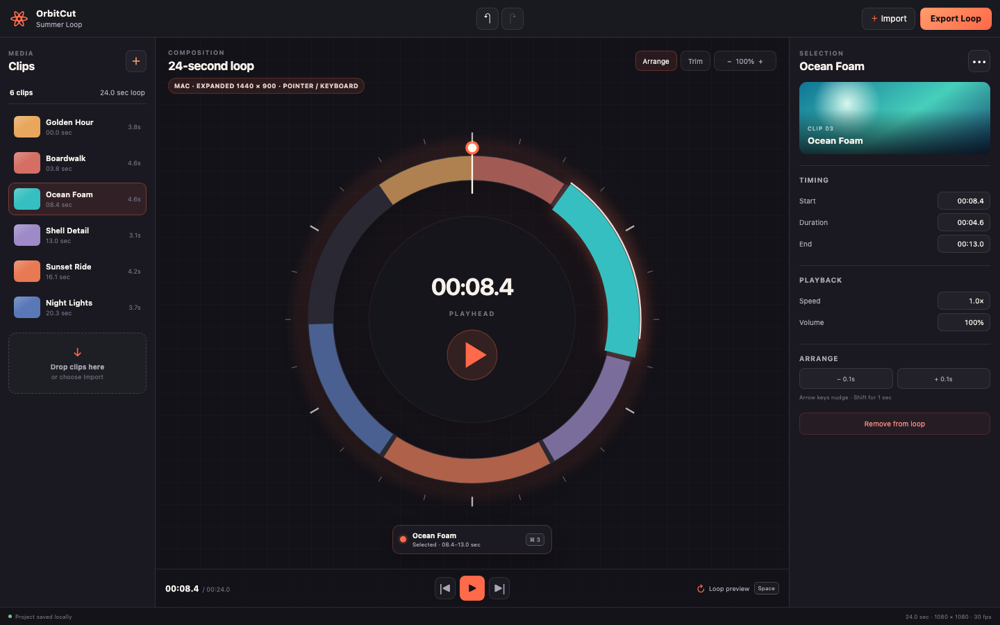
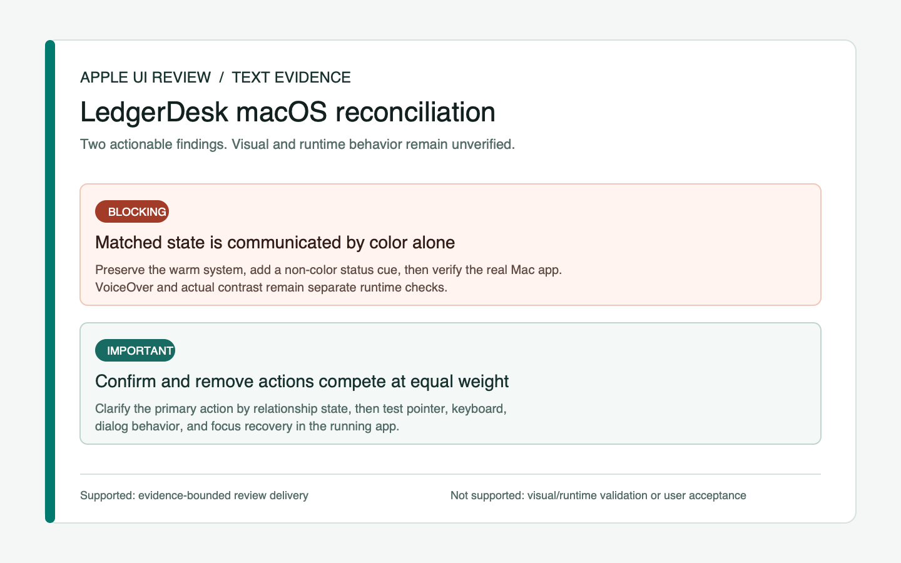

<div align="center">

# Apple UI Design

**面向 iOS、iPadOS 与 macOS 的产品优先型 UI 设计 Plugin，强调原生、独特与可验证。**

[English](README.md) · [简体中文](README.zh-CN.md)

</div>

## 项目简介

Apple UI Design 是一个用于 Apple 生态产品界面设计、适配与评审的纯 Skills Plugin。

它从产品意图和项目证据出发，将共享的产品 DNA 与符合平台习惯的交互方式结合起来。Apple 设计规范用于指导体验，但不会把所有产品都塑造成同一种视觉模板。

它同时覆盖已有产品与从零产品。已有产品从当前项目证据中理解；从零产品使用明确假设和公开研究推进，但不会把未经测试的判断冒充已经验证的用户需求。

可安装 Plugin 包含三个聚焦的 Skill；它们共享同一套证据与平台方法，不会争抢同一类任务。

## 内置 Skills

- **`$apple-ui-direction`**——产品与视觉方向、页面、流程、设计系统和设计型原型。
- **`$apple-platform-adaptation`**——在 iOS、iPadOS 与 macOS 之间转化既有产品，而不是放大布局。
- **`$apple-ui-review`**——依据证据评审已有设计、原型与 UI 实现。

SwiftUI 生产架构、调试、性能、CI 与发布仍属于工程职责。以上 Skills 向相应工程工作流提供产品意图、界面决策、证据要求和验收标准。

## 已验证工作流示例

以下示例均来自仓库中已保存的真实评测输出，不是概念性的能力宣传。每个示例都会标明产物类型、实现边界，以及现有证据能支持的最强验证结论。

### 界面方向：Today

**示例请求：** 使用 `$apple-ui-direction`，把已经确认的承诺模型做成视觉上真正不同、同时保留温暖感的两套 iPhone 方向。

**证据标签：** 设计 — 两套已渲染的视觉假设。原型 — 仅静态 HTML。产品代码 — 无。体验验证 — 未执行，视觉方向尚未得到用户确认。



该结果把层级与产品侧重点的取舍做成可见产物，而不是用换色冒充不同方向。查看[完整方向说明](evals/delivery-contracts/runs/2026-07-29/visual-direction/README.md)与[渲染验证](evals/delivery-contracts/runs/2026-07-29/visual-direction/validation-report.md)。

### 平台适配：OrbitCut

**示例请求：** 使用 `$apple-platform-adaptation`，把已有的径向 iPhone 编辑器带到 iPad 和 Mac，同时避免直接拉伸手机布局。

**证据标签：** 设计 — 共享/平台特定决策与四套已渲染布局。原型 — 仅静态 HTML。产品代码 — 无。体验验证 — 尚未运行原生窗口、输入、焦点和无障碍流程。



该结果保留径向时间线的核心地位，同时分别处理 iPad 紧凑、iPad 展开、Mac 最小窗口和 Mac 展开窗口的层级与密度。查看[适配决策矩阵](evals/delivery-contracts/runs/2026-07-29/platform-adaptation/decision-matrix.md)与[验证边界](evals/delivery-contracts/runs/2026-07-29/platform-adaptation/validation.md)。

### 界面评审：LedgerDesk

**示例请求：** 使用 `$apple-ui-review`，只根据一份高信任 macOS 对账任务的文字实施包，对有证据支持的问题进行优先级排序。

**证据标签：** 评审/验证结果 — 1 个 Blocking、1 个 Important。原型 — 无。产品代码 — 无。体验验证 — 因缺少截图和运行时访问而不支持。



该结果不会虚构视觉缺陷，而是只报告有依据的问题，并把键盘、VoiceOver、窗口、本地化和恢复机制分别列入精确验收路径。查看[完整评审报告](evals/delivery-contracts/runs/2026-07-29/ui-review/review.md)与[原始评审包](evals/delivery-contracts/fixtures/ui-review.md)。

## 触发与工程边界

是否调用内置 Skill 取决于用户要求的最终结果，而不是提示中是否出现 Apple、SwiftUI、UIKit 或 AppKit。

- 产品方向、页面、流程、设计系统、交互、动效和设计型原型交给 `$apple-ui-direction`。
- 将既有产品体验转化到其他 Apple 平台交给 `$apple-platform-adaptation`。
- UI 批评、审计、验证、验收评审和问题优先级交给 `$apple-ui-review`。
- 编译、并发、状态管理、架构、性能、API 用法、测试基础设施、CI、打包与发布交给适用的工程工作流。

当代码是回答已确认设计问题所必需的最低成本证据，并且不会改变既有架构时，设计 Skill 可以创建一次性原生原型，或执行范围明确的 SwiftUI 表现层改动。生产集成、业务逻辑、数据、依赖、广泛重构及工程正确性不属于其独立职责。

UIKit 与 AppKit 项目仍然可以使用本 Plugin 完成设计、适配与评审。Plugin 会检查它们的真实证据并交付与框架匹配的设计决策，但不会承诺 SwiftUI 实现、静默迁移框架，也不会在缺少适用工程工作流和原生验证时宣称 UIKit/AppKit 生产集成已经完成。

三个内置 Skill 的目标已经相互区分，因此保留隐式调用，并在各自 `agents/openai.yaml` 中明确声明同一策略。根级旧版兼容路由仍然只能显式调用。

## 核心原则

1. **产品意图优先。** 已确认的决策定义预期体验，同时通过证据标签区分已知用户需求与假设。
2. **项目上下文是本地事实依据。** 在作出新决定前，先检查现有需求、设计系统、组件、资产与平台目标。
3. **用户拥有产品方向决策权。** Skill 会说明平台、可用性和无障碍影响，但不会静默替换用户已经确认的交互或动效方案。
4. **原生不等于千篇一律。** 原生验证检查行为和语义，而不是检查界面是否像 Apple 系统 App；自定义视觉与控件仍然有效。
5. **跨平台需要适配，而不是放大。** iPhone、iPad 与 Mac 可以共享同一产品，但在层级、密度、导航和输入方式上应合理变化。
6. **可访问性与本地化保护体验结果，而非统一皮肤。** 它们从设计阶段进入验证，同时保留品牌表达。
7. **视觉与动效质量需要证据。** 编译成功不等于体验通过；重要状态和真实交互需要经过渲染与验证。

## 决策权与取舍

Plugin 不再使用一个包办所有问题的权威排序，而是区分：

- 法律、安全、信息安全、隐私、合同，以及项目明确要求的核心体验硬边界；
- 用户或项目产品负责人的产品结果、目标用户、品牌、交互与动效决策；
- 核心任务可感知、可操作、可恢复等体验结果底线；
- 作为不同强度证据或建议的 Apple 规范、原生行为、已发布界面、实现约束与外部灵感。

Apple 规范和原生组件可以揭示风险、降低实现不确定性，但不拥有产品视觉身份。已经上线的行为只是现状证据，不自动代表正确。当重要选择存在分歧时，Plugin 会说明观察事实、用户影响、推荐方案、验证路径和最终决策。用户在理解取舍后确认选择，除非仍存在硬边界冲突，否则 Skill 会记录并继续，不反复争夺决策权。

沟通节奏可以由用户定义。只有阻塞且会改变后续路径的产品决策，才默认一次聚焦一个问题；彼此独立的事实缺口可以集中收集或并行核实。

## 交付合同

每项任务只选择一个主要合同。合同定义开始前需要什么证据、用户最终获得什么产物，以及现有证据最多能支持哪一级完成声明。

| 合同 | 最低交付物 | 声明完成所需证据 |
|---|---|---|
| 视觉方向 | 使用代表性真实内容的关键画面；方向未确定时提供具有实质差异的可见方案 | 已渲染画面；不能只凭文字或精确参数宣称高保真方向完成 |
| 页面或流程 | 覆盖必要状态、转换、恢复和输入行为的可操作路径 | 交互原型或运行实现；静态画面只能证明外观 |
| 设计系统 | 语义 Token、组件意图、代表性状态及其在真实产品页面中的应用 | 已渲染组件状态和至少一个代表性产品应用 |
| 跨平台适配 | 共享与平台差异矩阵，以及每个目标环境的代表布局和输入行为 | 各关键尺寸的可见证据；涉及窗口、输入或平台行为的声明必须经过原生运行 |
| 原生原型 | 有明确范围的 SwiftUI 行为、代表性状态、无障碍语义、版本降级，以及有动效时的 Reduce Motion 表达 | SwiftUI Preview、模拟器或真机，或真实 macOS App；交互与动效声明需要录屏 |
| UI 评审 | 证据状态，以及按严重度排列的事实、影响、建议和验证方法 | 结论受用户提供的产物与运行证据约束；只有文字时只能提供未验证咨询 |

所有精确视觉值都必须来自项目依据、已渲染产物，或明确标记为“建议值、尚未验证”。交互与动效决定仍属于用户：Plugin 可以建议、制作原型和验证，但不能静默替换已确认的产品选择。

完成状态必须分层表达：**方向已对齐**、**设计完成**、**原型完成**、**代码完成**、**体验已验证**、**用户已验收**。不得从前一阶段自动推导后一阶段。

## 回归测试

仓库使用两层互补的回归机制：

- **确定性 CI 检查**用于验证 Plugin 结构、来源完整性、交付合同、产品起点、路由规则、固定的 15 案例 Skill 矩阵、输出断言和受保护的黄金输出校验和。
- **全新会话模型检查**在不泄露断言的前提下运行选定 Prompt，再用同一案例定义检查保存的 Skill 加载轨迹与最终输出。

每个内置 Skill 都固定包含一个直接请求、一个间接请求、一个信息不足案例、一个仅工程负例和一个证据风险边界案例。每个案例都包含固定输入素材、应加载和禁止加载的 Skill、必需输出行为以及禁止声明。

运行完整确定性门禁：

```bash
python3 scripts/run_regression_checks.py
```

检查一次保存的新会话结果：

```bash
python3 scripts/evaluate_skill_regression_output.py \
  <case-id> --trace <trace.jsonl> --output <output.md>
```

CI 不调用在线模型，因为网络状态和模型波动不应伪装成确定性的发布门禁。真实模型运行需要单独保存，并且 Prompt 中不得包含隐藏断言。

Issue #6 另有一套 7 案例决策权回归，覆盖已确认的自定义交互、已上线缺陷、无障碍结果、隐私硬边界、实现便利、沟通节奏与项目内部术语。

Issue #9 增加当前来源核验套件，覆盖精确 Apple 页面、来源不可用时的降级、最低版本与增强版本分离，以及官方来源和项目实测冲突。保存的 Liquid Glass 记录验证 iOS 26 API 结论和 iOS 17 受保护降级，但不会把最新材质自动设为默认方向。

Issue #7 增加 6 案例可访问性与本地化套件，覆盖平台任务矩阵、多种辅助技术、视觉设置、自定义控件和本地化风险。保存的 Stillpoint 记录只证明语义自动化与指定的 Reduce Motion 任务；尚未执行的 VoiceOver 路径仍明确标记为未验证。

Issue #14 增加交互与动效方法及固定回归，分别覆盖工具型、内容型与实验性交互。它保护用户已经确认的交互方向，并要求通过任务状态、输入、打断、反向、恢复、Reduce Motion 和原生录屏来验证实际行为，而不是用常见 Apple 模式或系统组件替代产品判断。

Issue #8 增加内容与敏感流程方法，覆盖权限、隐私、身份、账户数据、订阅购买和受监管领域。它要求内容真实、用户知情且可控、选择不受操纵、失败后可恢复，并在设计 Skill 无权决定法律、医疗、金融或商业事实时保留当前政策来源与专业审校边界。

Issue #10 增加运行时上下文预算和条件加载契约。Skill 入口文件只保留角色、核心流程、路由和关键证据底线；详细方法由唯一的共享 reference 持有，并且只在其声明的任务条件命中时加载。Skill 入口从 3,382 词降至 2,194 词，运行时总指令从 19,083 词降至 17,457 词，固定回归结果没有下降。仓库历史、比较记录和发布维护信息继续留在安装包运行路径之外。

## 安装 Plugin

先将本公开仓库添加为 Codex Marketplace，再安装 Plugin：

```bash
codex plugin marketplace add RexYoung000/apple-ui-design-skill --ref main
codex plugin add apple-ui-design@apple-ui-design
```

安装后新建 Codex 会话，使三个内置 Skills 被加载。在 ChatGPT 桌面应用中，重启应用，打开 **Plugins**，选择 **Apple UI Design** Marketplace，然后安装 **Apple UI Design**。

仓库更新后刷新 Marketplace 并重新安装：

```bash
codex plugin marketplace upgrade apple-ui-design
codex plugin add apple-ui-design@apple-ui-design
```

GitHub Marketplace 是当前公开安装路径。本仓库不会把“已提交到 OpenAI 通用 Plugins Directory”作为已完成事实；那属于单独的正式发布步骤。

官方说明参见[构建 Skills](https://learn.chatgpt.com/docs/build-skills)、[包装 Plugins](https://developers.openai.com/plugins/build/plugins)与[使用 Plugins](https://learn.chatgpt.com/docs/plugins)。

## 从旧版独立 Skill 迁移

旧版安装方式会把本仓库克隆到 `$HOME/.agents/skills/apple-ui-design`，并调用 `$apple-ui-design`。根级 Skill 仍作为旧版显式调用兼容路由存在，但不会装进 Plugin，也不会再被自动触发。

安装 Plugin 后：

- 方向、页面、流程、设计系统或原型任务将 `$apple-ui-design` 替换为 `$apple-ui-direction`；
- 跨平台产品转化使用 `$apple-platform-adaptation`；
- 评审与验证使用 `$apple-ui-review`。

确认 Plugin 可用后，再删除或移走旧版独立 Skill；否则选择器中可能同时出现兼容路由和新 Skills。

## 在 Codex 中使用

使用 `$` 明确调用 Skill：

```text
使用 $apple-ui-direction 为这个 iPad 应用设计新用户引导流程。
```

Codex 也可以在请求与 Skill 描述匹配时自动选择它：

```text
使用 $apple-ui-review 评审这个 macOS 界面的信息层级、
键盘操作、可访问性及其与现有产品设计系统的一致性。
```

## 在 ChatGPT 桌面应用中使用

从 **Plugins** 安装 **Apple UI Design**。在新会话输入框中键入 `@`，选择对应的内置 Skill，然后描述任务：

```text
使用 Apple Platform Adaptation 将这个现有 iPhone 流程适配到 iPad 和 Mac。
```

被选中的 Skill 会先检查项目中已有的证据，再提出问题。对于阻塞且会改变后续路径的产品决策，它默认一次确认一个关键问题并说明推荐理由；独立事实可以集中收集，用户也可以选择逐步、批量、工作坊或“明确假设后继续”的沟通节奏。

对于已有产品，Skill 会从当前证据提取目标用户、核心任务、设计 DNA 和交互模型。对于从零产品，Skill 会明确区分用户确认、外部证据、设计推断与待验证假设。

## 研究与灵感

Skill 使用混合研究模式：

- 内置经过分类的 Apple 官方来源、真实案例、公开 UI 与动效网站、灵感站点和素材来源索引；
- 根据当前产品与设计问题进行实时研究；
- 明确区分权威依据、可观测案例、纯灵感与待验证假设。

60fps、Recent、Awwwards、React Bits、Magic UI 等 Web 来源可以启发视觉与动效方向，但不能证明 Apple 原生行为。第三方截图和素材默认只进行观察和链接；未核验复用权利时不会打包进仓库。

## 仓库结构

```text
.
├── SKILL.md
├── agents/
│   └── openai.yaml
├── .agents/
│   └── plugins/
│       └── marketplace.json
├── .github/
│   └── workflows/
│       └── validate.yml
├── docs/
│   └── maintenance-and-sources.md
├── evals/
│   ├── plugin-split/
│   │   └── runs/
│   ├── decision-authority/
│   │   ├── README.md
│   │   ├── cases.json
│   │   └── runs/
│   ├── trigger-routing/
│   │   ├── README.md
│   │   ├── cases.json
│   │   └── runs/
│   ├── skill-regression/
│   │   ├── README.md
│   │   ├── cases.json
│   │   ├── fixtures/
│   │   └── goldens.json
│   ├── delivery-contracts/
│   │   ├── README.md
│   │   ├── cases.json
│   │   ├── fixtures/
│   │   └── runs/
│   ├── current-source-verification/
│   │   ├── README.md
│   │   ├── cases.json
│   │   ├── fixtures/
│   │   └── runs/
│   ├── accessibility-localization/
│   │   ├── README.md
│   │   ├── cases.json
│   │   └── runs/
│   ├── interaction-motion/
│   │   ├── README.md
│   │   ├── cases.json
│   │   └── runs/
│   ├── content-sensitive-flows/
│   │   ├── README.md
│   │   ├── cases.json
│   │   └── runs/
│   ├── runtime-context/
│   │   ├── README.md
│   │   ├── contract.json
│   │   └── runs/
│   └── product-starting-point/
│       ├── README.md
│       ├── cases.json
│       ├── fixtures/
│       └── runs/
├── plugins/
│   └── apple-ui-design/
│       ├── .codex-plugin/
│       │   └── plugin.json
│       ├── references/
│       └── skills/
│           ├── apple-platform-adaptation/
│           ├── apple-ui-direction/
│           └── apple-ui-review/
├── scripts/
│   ├── run_regression_checks.py
│   ├── validate_decision_authority_evals.py
│   ├── evaluate_skill_regression_output.py
│   ├── validate_skill_regression_evals.py
│   ├── validate_trigger_routing_evals.py
│   ├── validate_product_starting_point_evals.py
│   ├── validate_delivery_contract_evals.py
│   ├── validate_current_source_evals.py
│   ├── validate_accessibility_localization_evals.py
│   ├── validate_interaction_motion_evals.py
│   ├── validate_content_sensitive_flow_evals.py
│   ├── validate_runtime_context.py
│   ├── validate_plugin_architecture.py
│   └── validate_source_registry.py
└── tests/
    ├── test_accessibility_localization_evals.py
    ├── test_current_source_evals.py
    ├── test_decision_authority_evals.py
    ├── test_skill_regression_evals.py
    ├── test_skill_regression_output.py
    ├── test_trigger_routing_evals.py
    ├── test_plugin_architecture.py
    ├── test_delivery_contract_evals.py
    ├── test_content_sensitive_flow_evals.py
    ├── test_runtime_context.py
    ├── test_interaction_motion_evals.py
    ├── test_product_starting_point_evals.py
    └── test_source_registry.py
```

- `plugins/apple-ui-design/` 是完整可安装包，不包含仓库 README、Issue 历史或评测运行记录。
- `plugins/apple-ui-design/skills/` 包含三个可独立发现的工作流。
- `plugins/apple-ui-design/references/` 是产品、证据、平台、无障碍、研究与验证规则的唯一共享来源。
- `.agents/plugins/marketplace.json` 通过公开 GitHub 仓库暴露 Plugin。
- 根级 `SKILL.md` 与 `agents/openai.yaml` 只为旧版独立安装提供显式调用兼容。
- `evals/plugin-split/` 保留三个内置 Skills 的独立前向测试与安装后新会话证据。
- `evals/trigger-routing/` 区分正向设计意图、仅工程负例和设计与工程混合边界案例。
- `evals/skill-regression/` 是统一的 15 案例触发与输出矩阵及黄金输出注册表。
- `evals/delivery-contracts/` 为六类交付合同分别提供一项真实任务与可观察的证据断言。
- `evals/current-source-verification/` 用于保护精确 Apple 来源、来源不可用、版本降级、运行冲突和保存的 Liquid Glass 核验记录。
- `evals/accessibility-localization/` 用于保护平台任务、辅助技术证据边界、视觉设置、自定义控件和本地化风险方法。
- `evals/interaction-motion/` 用于保护用户决策权、交互体验契约、动效语言、平台输入、打断与反向、Reduce Motion 和原生证据边界。
- `evals/content-sensitive-flows/` 用于保护内容清晰度、权限与隐私控制、身份和账户数据路径、商业透明度、失败恢复、专业边界与证据声明。
- `evals/runtime-context/` 记录优化前基线，并保护规则单一所有权、reference 条件加载、长文档目录和运行时规模预算。
- `evals/product-starting-point/` 提供固定的小改动、重大改版与从零产品证据场景、评审断言和保留的前向测试证据。
- `scripts/validate_current_source_evals.py` 用于检查来源记录、精确 Apple URL、访问日期、版本分离、降级方案、证据标签和运行产物。
- `scripts/validate_accessibility_localization_evals.py` 用于检查 Issue #7 的六类方法覆盖、Skill 路由和来源标记。
- `scripts/validate_interaction_motion_evals.py` 用于检查 Issue #14 的三类产品场景、三项 Skill 路由与方法覆盖。
- `scripts/validate_content_sensitive_flow_evals.py` 用于检查 Issue #8 的五类高风险流程、当前官方来源与三项 Skill 覆盖。
- `scripts/validate_runtime_context.py` 用于测量安装包指令规模，并检查 reference 所有权、加载条件、长文档目录与上下文预算。
- `scripts/validate_delivery_contract_evals.py` 用于检查合同覆盖、固定素材、必需产物、禁止声明和证据要求。
- `scripts/validate_trigger_routing_evals.py` 用于检查路由覆盖、实现边界和必须覆盖的工程负例领域。
- `scripts/evaluate_skill_regression_output.py` 在不向模型泄露断言的情况下检查一次保存的加载轨迹和响应。
- `scripts/run_regression_checks.py` 是本地和 CI 共用的唯一确定性入口。
- `scripts/validate_product_starting_point_evals.py` 用于检查评测结构、必需场景、行为断言和固定素材路径。
- `scripts/validate_plugin_architecture.py` 用于保护 Skill 边界、共享规则所有权和安装包纯度。
- `tests/` 用于保护 Plugin 架构、评测与资源校验器必须识别的错误场景。
- `.github/workflows/validate.yml` 会在 push 与 pull request 中执行同一套确定性门禁。

## 边界

该 Plugin 负责产品意图、视觉层级、Apple 平台行为、设计系统决策、适配策略和体验评审标准。

它不能替代 Swift 架构、并发、性能分析、CI、打包或发布等专项工程流程。当这些内容成为主要任务时，应将对应内置 Skill 与相应工程工作流配合使用。

## 维护原则

稳定的设计原则保存在 Plugin 的共享 references 中。当某项决策依赖具体版本时，应通过 Apple 当前官方资料核对 API、平台行为与 Human Interface Guidelines。

仓库维护策略与回归测试提示详见 [`docs/maintenance-and-sources.md`](docs/maintenance-and-sources.md)。

## 开源协议

本项目采用 [MIT License](LICENSE)。
