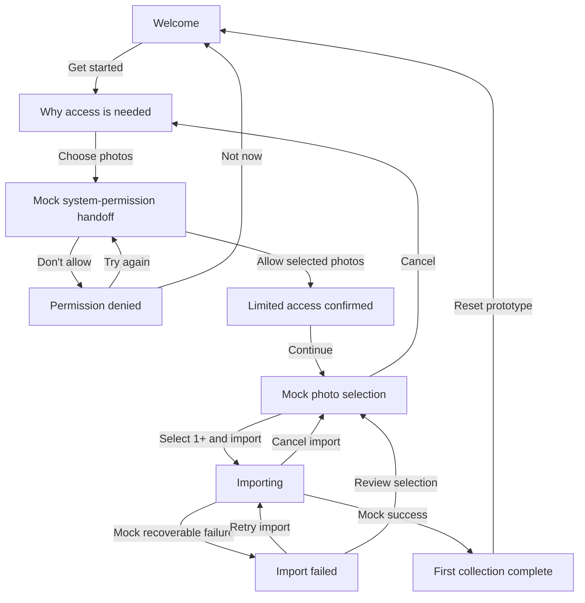

# State and transition map

## State rules

| State | Primary action | Secondary/cancel action | Preserved data |
|---|---|---|---|
| Welcome | Get started | None | None |
| Explanation | Choose photos | Back | None |
| Permission handoff (mocked) | Allow selected photos | Don’t allow | Trigger focus |
| Denied | Try again | Not now | Denial meaning |
| Limited access | Continue | Back | Limited grant |
| Selection (mocked) | Import selected | Cancel | Selected mock photo IDs |
| Importing | Wait for result | Cancel import | Selected mock photo IDs |
| Recoverable failure | Retry import | Review selection | Selected mock photo IDs |
| Completion | Reset prototype | None | Imported mock photo IDs |

## Prototype controls

The “next import result” control is outside the app surface. It exists only to make the recoverable-failure path deterministic and operable. Permission results remain inside a clearly labelled simulated system sheet so the user can operate denial and retry directly.
